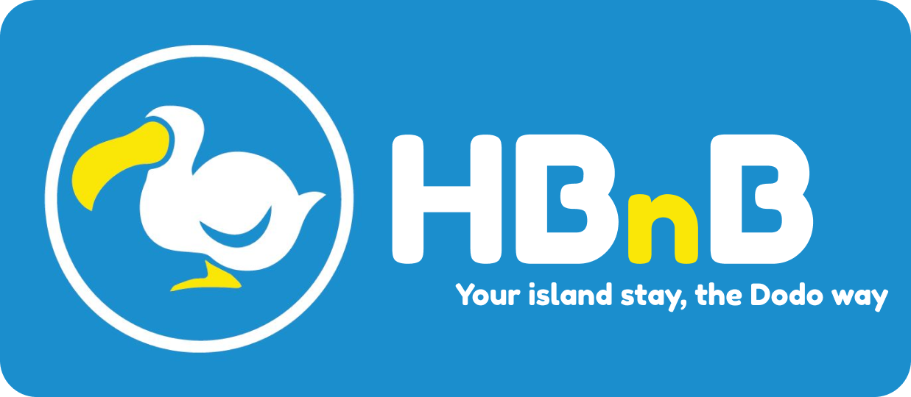
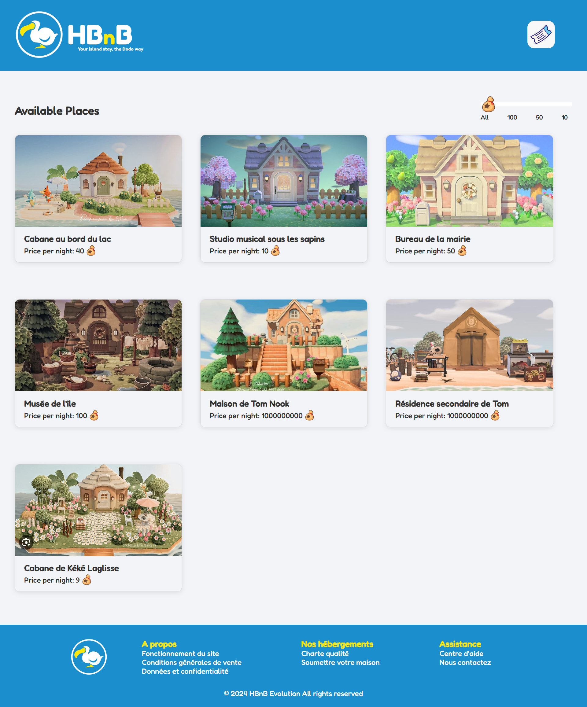
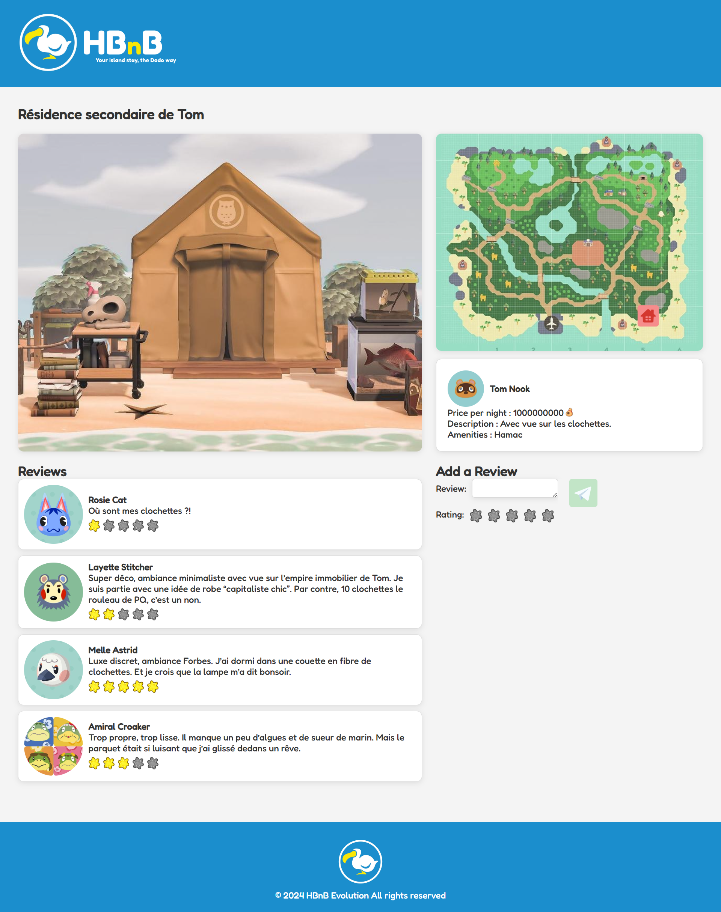

# HBnB — Modular Web Application Inspired by Airbnb

*[Lire en français](README.fr.md)*

**HBnB** is a modular web application developed step-by-step at **Holberton School**,
covering software architecture design, REST API development, authentication and database integration.

---

## 📸 Preview






---

## 🛠️ Tech Stack

| Layer | Technologies |
| ------- | ------------- |
| Backend | Python 3 · Flask · Flask-RESTx |
| Auth | Flask-JWT-Extended · Flask-Bcrypt |
| ORM & Database | SQLAlchemy · SQLite (dev) · MySQL (prod) |
| Frontend | HTML5 · CSS3 · Vanilla JavaScript |
| Design & Docs | UML · Mermaid.js · Swagger · Figma · Markdown |
| Tests | unittest · curl |

---

## 📐 Project Phases

### Part 1 — Architecture & Modeling

Design phase focused on modeling the full system before writing any code:

- **Package diagrams** — modular component organization
- **Class diagrams** — entities and relationships (User, Place, Review, Amenity)
- **Sequence diagrams** — use cases (create user, create place, post review, list places)
- **Entity documentation** — business rules and constraints

👉 See: `part1/` and `docs/`

---

### Part 2 — Business Logic & REST API

Implementation of core entities and REST API endpoints:

- Full CRUD on Users, Places, Reviews, Amenities
- 3-tier architecture: Presentation (API) · Business Logic (Services) · Persistence
- **Facade design pattern** between API, models and repository
- In-memory repository for rapid prototyping
- Automated tests (unittest) and manual testing via Swagger

👉 See: `part2/`

---

### Part 3 — Authentication & Database Integration

- **JWT authentication** (Flask-JWT-Extended) — secure login, token-based access
- **Password hashing** (Flask-Bcrypt) — never stored in plaintext
- **Role-based access control** — admin vs. regular users (`is_admin` flag)
- **SQLAlchemy ORM** replacing in-memory storage
- Database relationships:
  - One-to-many: Users → Places, Users → Reviews
  - Many-to-many: Places ↔ Amenities (association table)
- **SQLite / MySQL** dual support for dev and production environments
- ER diagrams with Mermaid.js

👉 See: `part3/`

---

### Part 4 — Frontend (solo)

Fully designed and developed independently:

- **UI/UX design** — Animal Crossing theme, custom logo, consistent visual identity
- Listing grid with price filter
- Login & Signup page with JWT authentication
- Place detail page with reviews, map and amenities
- Vanilla HTML/CSS/JS — no framework

👉 See: `part4/`

---

## 💡 Key Skills Demonstrated

- Translating UML architecture into production-ready Python code
- Designing and consuming a RESTful API (Flask, Flask-RESTx, Swagger)
- Implementing secure authentication with JWT and bcrypt
- Modeling relational databases with ORM and managing complex relationships
- Writing unit and integration tests (unittest)
- Designing a UI from scratch — visual identity, UX choices, responsive layout
- Working collaboratively with Git in a team context

---

## 🚀 Run locally

### Prerequisites

- Python 3.10+
- pip
- SQLite or MySQL

### Installation

```bash
# Clone the repo
git clone https://github.com/Helvlaska/holbertonschool-hbnb.git
cd holbertonschool-hbnb

# Install dependencies
pip install -r requirements.txt

# Run the API (Part 2 or Part 3)
cd part2/hbnb  # or part3/hbnb
python run.py

# Run the frontend (Part 4) — in a separate terminal
cd part4
python3 -m http.server 8080
# Then open http://localhost:8080
```

---

## 👩‍💻 Authors

**Backend (Parts 1–3)** — developed in collaboration:

- **Claire Castan** — [LinkedIn](https://www.linkedin.com/in/claire-castan) · [GitHub](https://github.com/Helvlaska)
- **Anne-Cécile Colléter**

**Frontend (Part 4)** — designed and developed solo by:

- **Claire Castan** — UI/UX design, visual identity, Animal Crossing theme, logo creation

📄 Educational project — Holberton School
