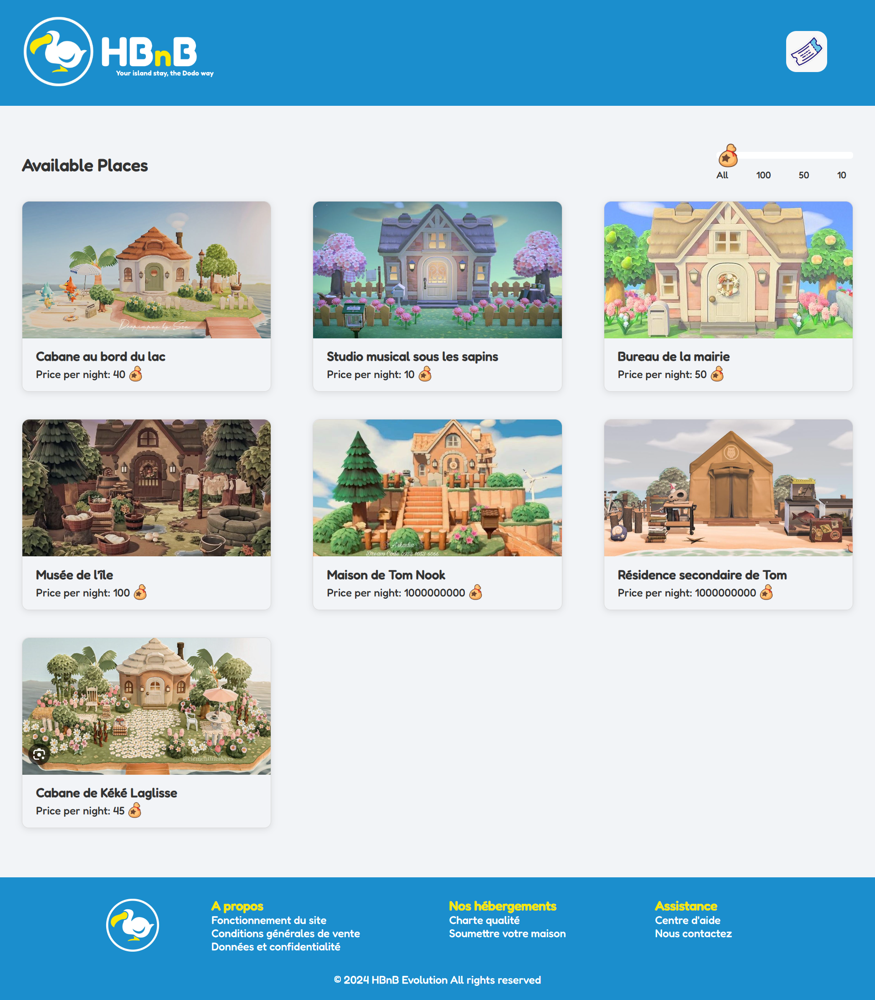
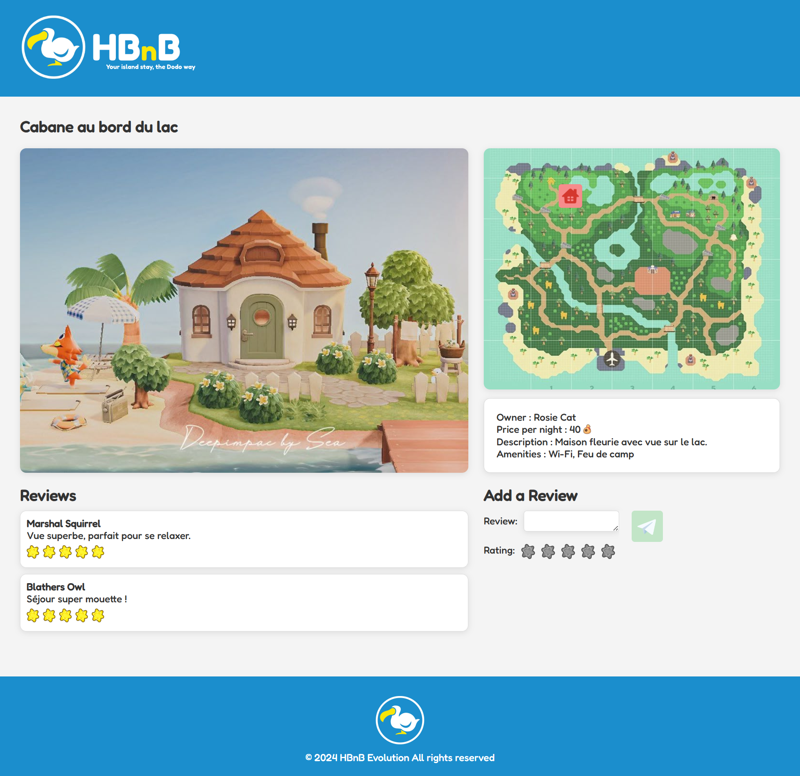
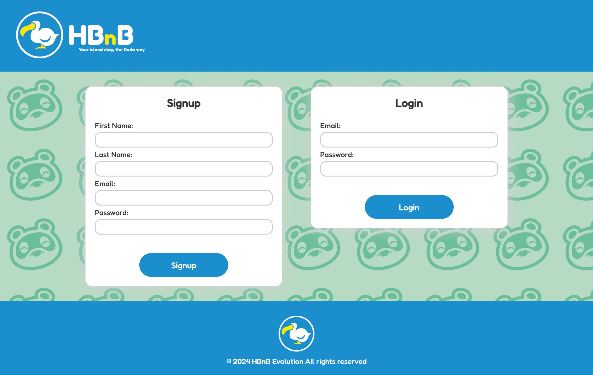
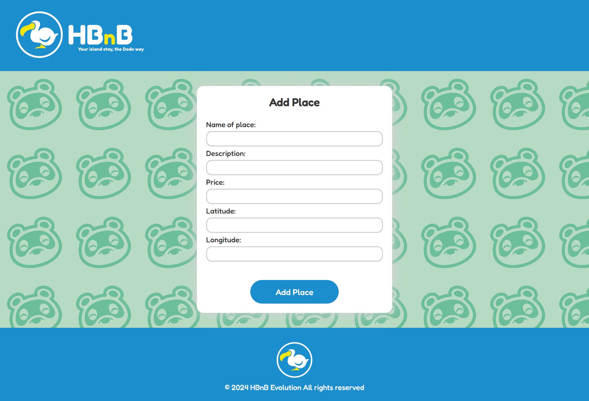

# HBnB – Partie 4 : Client Web Interactif

## 📝 Description

Cette dernière partie du projet HBnB consiste à construire une interface web interactive, moderne et fonctionnelle, en HTML5, CSS3 et JavaScript ES6.
Ce client communique avec l’API REST développée dans la partie 3 du projet, afin de permettre la navigation, l’authentification, la consultation des lieux et l’ajout de commentaires.

---

## 🎯 Objectifs pédagogiques

- Utiliser HTML5 et CSS3 pour construire une interface web structurée et responsive.
- Manipuler le DOM avec JavaScript moderne (ES6).
- Consommer une API sécurisée avec le `Fetch API`.
- Gérer l’authentification via JWT (JSON Web Token) stocké dans un cookie.
- Appliquer les bonnes pratiques du développement front-end moderne.

---

## 📁 Structure des fichiers attendus

part4/
├── css/
│   ├── login.html
│   ├── place.html
│   └── styles.css
│
├── js/
│   ├── scripts.js
│   ├── auth.js
│   ├── api.js
│   ├── utils.js
│   ├── index.js
│   ├── login.js
│   ├── place.js
│   └── review.js
│
├── images/
│   ├── logo.png
│   ├── icon.png
│   └── [autres images libres]
│
├── index.html
├── login.html
├── place.html
│
├── README.md
├── .gitignore
└── package.json

---

## 🧪 Tests à effectuer

- ✅ Connexion avec identifiants valides et invalides.
- ✅ Stockage correct du token dans les cookies.
- ✅ Affichage dynamique des lieux et des détails.
- ✅ Fonctionnalité de filtre par prix.
- ✅ Affichage et soumission du formulaire de review.
- ✅ Redirection des utilisateurs non connectés.
- ✅ Validité HTML5/CSS3 sur tous les fichiers.

---

## 🚀 Lancement du projet en local

### 🔌 Lancer le back-end (API Flask – partie 3)

Dans un terminal, depuis le dossier `part3/` :

```bash
export FLASK_APP=run.py
export FLASK_ENV=development
flask run
```

### 🌐 Lancer le front-end (HTML + JS – partie 4)

Dans un second terminal, depuis le dossier part4/ :

```bash
python3 -m http.server 5500
```

---

## 🎨 Design & structure HTML

Respect des fichiers fournis en base, avec :

- Header avec logo (.logo) et bouton connexion (.login-button)
- Cartes lieux (.place-card) et avis (.review-card)
- Classes CSS imposées : .details-button, .place-details, .place-info, .add-review, .form, etc.
- Structure responsive et validée W3C

---

## ✨ Fonctionnalités

- Authentification via formulaire de connexion
- Stockage du JWT dans un cookie sécurisé
- Affichage dynamique de la liste des lieux
- Filtrage par prix (client-side)
- Détail complet d’un lieu (description, hôte, équipements, avis)
- Ajout d’un avis (si connecté)
- Redirection automatique si non authentifié

---

## 🛠️ Technologies

- HTML5 / CSS3
- JavaScript ES6 (Fetch API, DOM)
- API REST Flask (partie 3)
- JWT Auth via cookies
- Local hosting (http.server, Flask)

## 🖼️ Aperçu visuel






## ✅ Validation par W3C HTML & CSS

OK ✅
